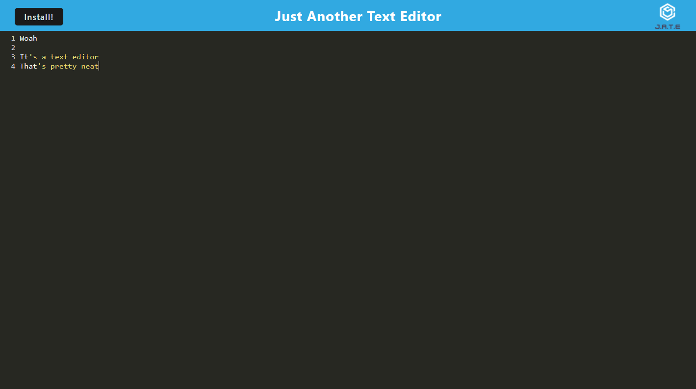

# PWA Text Editor

## Description

A simple text editor that can be downloaded and installed locally. Text is saved and loaded between sessions. 

## Table of Contents

- [Usage](#usage)
- [Credits](#credits)
- [Contribution](#contribution)
- [Questions](#questions)

## Usage

 

## Credits

This program was made using starter code.
Additional advising and code was provided by a learning assistant. 

## Contribution

Currently, this is a solo developer project.

## Questions

Any questions about this software can be directed to the author via
Github: https://github.com/joshmusto